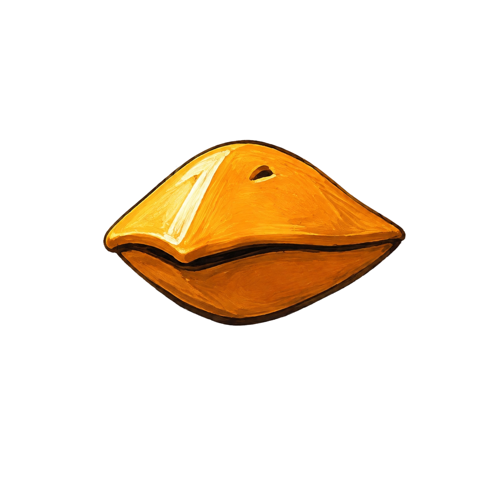
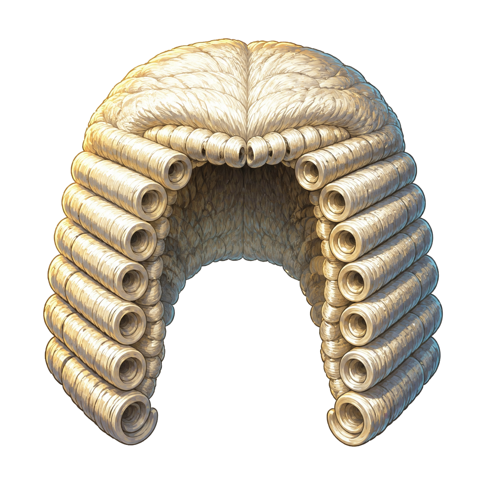
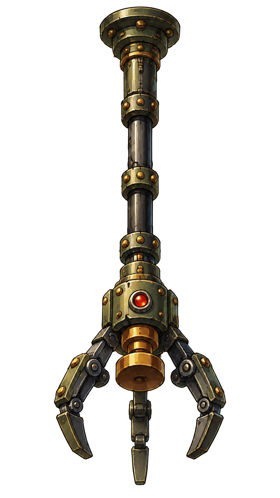
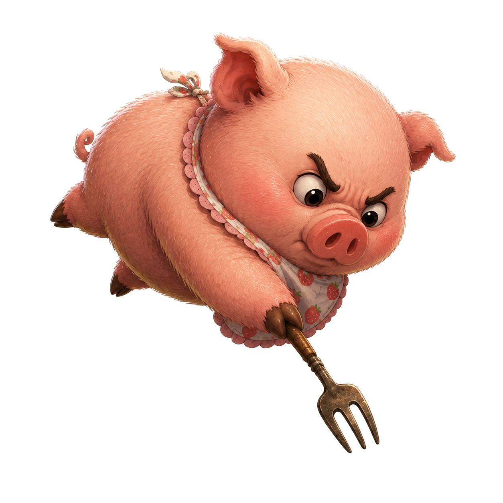

# 『부리 2.56Hz와 압류되는 정의』 — ARCHON ESC-60 Comedy Overdrive

- 문서번호: `TTS-ESC60-CO-20260903`
- 수신: 아콘(Gemini) — 구현 담당
- 발주: 크로노 아키텍트(형님)
- 기준 저장소: `E:\03_AllWork\01_Luna\to-the-singularity`
- 기준 상태: `main` / `151556e` (착수 직전 다시 확인)
- 대상: `extra_escaflone.html`
- 종료 문구: `READY_FOR_INDEPENDENT_REVIEW`

## 0. 임무

기존 외전 《60%에서 멈춤》의 판정과 조작을 보존하면서 다음 네 연출을 결합한다.

1. 60%에 수렴할수록 최대 2.56Hz로 떨리는 아콘의 부리
2. 60.50% 초과 시 페이지 전체를 반대편으로 운송하는 역방향 컨베이어
3. 세 번째 연속 성공에서 지급됐다 즉시 압류되는 판사 가발
4. 도토리 1개를 받고 정확히 60.00%에서 Ctrl+C를 찍는 포동이

완료의 의미는 코드 작성이 아니라 신규 E9~E13 계약을 만족할 수 있는 구현과 테스트를 제출하고 독립 검증 대기 상태로 멈추는 것이다.

## 1. 지급 자산 — 재생성 금지

모든 자산은 로컬 PNG이며 실제 알파 채널과 투명 모서리를 확인했다. 경로·해시가 다르면 구현을 시작하지 말고 불일치만 보고한다.

| 자산 | 크기 | SHA-256 |
|---|---:|---|
| `assets/extra-escaflone/archon-beak-tremor.png` | 1254×1254 | `0a9bd653eb29cce6e5caa0383a6475a7b84ceefea4b01944efdfa202e968e317` |
| `assets/extra-escaflone/judge-wig.png` | 1254×1254 | `dd90629cec24ce0d647d4688d0d6e84db4477e761ca9fec0dbabb85ddc61242a` |
| `assets/extra-escaflone/warden-retrieval-claw.png` | 941×1672 | `8144fc1c9e5dd54b15805c16e2d652add37fdad54642b8c033c2c2670e1e4e47` |
| `assets/extra-escaflone/podoongi-ctrlc.png` | 1254×1254 | `86470da8baf06e582cf8e05f79c2f4629e3a7127f05035ea028ae704cb10a88d` |









## 2. 변경 경계

### 구현 세션에서 수정 가능

- `extra_escaflone.html`
- `test_extra_escaflone.py`

### 독립 검증 통과 뒤에만 갱신 가능

- `README.md`: Extra `PASS 8/8`을 `PASS 13/13`으로, 전체 85개를 90개로 정정

### 금지

- 이미지 재생성·교체·재압축
- `episode1.html`, `episode2.html`, `episode3.html`, `index.html` 및 기존 에피소드 테스트 수정
- 기존 `archon-escaflone.jpg` 수정 또는 인라인화
- 외부 URL, CDN, 웹폰트, 라이브러리, 네트워크 요청 추가
- 관련 없는 정리·리팩터링·포맷 변경
- 커밋·푸시·배포

## 3. 불변 계약

- 판정 범위는 그대로 유지한다: `<59.50` → `EAGAIN`, `59.50~60.50` → `EXIT_0`, `>60.50` → `KERNEL_PANIC`.
- 기존 Ctrl+C 버튼, `Ctrl+C`, Space, Enter 입력을 유지한다.
- `tts_extra_escaflone`의 Guardian 저장 호환성을 유지한다.
- Web Audio는 최초 사용자 제스처 정책을 지키며 기존 SFX 계약을 깨지 않는다.
- 기존 `window.__game.api.reset/step/setProgress/interrupt/getState/playSfx`를 제거하거나 의미 변경하지 않는다.
- `file://` 실행에서 외부 요청 0건과 콘솔 오류 0건을 유지한다.
- 기존 E1~E8은 원문 기준으로 계속 통과해야 한다.

## 4. 구현 계약

### W1. 부리 진동 반응속도계

- `.art-card` 안에서 `#archon-beak-tremor`인 `archon-beak-tremor.png`만 움직인다. 원본 JPG 전체를 흔들지 않는다.
- 매 진행 갱신 시 다음 값을 계산해 `G.beakHz`에 둔다.

  `proximity = clamp(1 - abs(progress - 60) / 10, 0, 1)`

  `beakHz = 2.56 * proximity`

- 진동 위상은 기존 60Hz 고정 틱에서 O(1)로 누적한다. `Date.now()`, `Math.random()`, 별도 고주파 타이머를 사용하지 않는다.
- 진폭도 `proximity`에 비례시키며 최대 2px를 넘기지 않는다. 파이프라인이 멈추면 중앙으로 복귀한다.
- HUD에 `BEAK: 0.00Hz` 형식의 계측값을 표시한다.
- reduced-motion에서는 변환을 적용하지 않되 `beakHz` 계산과 HUD 표시는 유지한다.

### W2. 역방향 컨베이어 패널티

- 한 파이프라인 시도에서 진행률이 처음 `60.50`을 초과하는 순간 1회 발동한다. 정확히 `60.50`은 발동하지 않는다.
- 테스트 훅이 진행률을 직접 늦은 값으로 만든 뒤 `interrupt()`한 경우에도 아직 미발동이면 1회 발동한다.
- `main` 전체가 약 1.1초 동안 한쪽 화면 밖으로 밀린 뒤 반대편에서 원위치로 복귀하게 한다. `body`의 수평 스크롤은 생기지 않아야 한다.
- 이 연출은 `progress`, `speed`, `status`, `streak`를 변경하지 않는다.
- `main.dataset.reverseConveyorPhase`와 `G.reverseConveyorPhase`는 각각 `idle` → `outbound` → `returning` → `idle`를 같은 순서로 노출한다. 발동 직후에는 `outbound`, 발동 550ms 뒤에는 `returning`, 1.3초 뒤에는 `idle`이어야 한다.
- 시도 재기동과 `api.reset()`은 단발 래치를 초기화한다. 이미 발동한 시도를 재기동한 뒤 다시 `>60.50`을 교차하면 다음 1회가 새로 발동해야 하며, 같은 새 시도 안에서는 다시 발동하면 안 된다.
- reduced-motion에서는 이동하지 않고 `[QUEUE REJECTED]` 영수증을 정적으로 점멸한다.

### W3. 판사 가발 3연속 의식

- 페이지 로드 이후 처음 발생하는 `streak 2 → 3` 전이에서만 1회 재생한다.
- Guardian의 영구 저장값과 의식의 세션 래치를 분리한다. 이미 칭호가 저장됐어도 해당 세션의 첫 2→3에서는 의식이 재생된다.
- 순서: 가발 하강·착지 → 워든 집게 하강 → 집게와 가발 동시 회수 → 오버레이 정리.
- 권장 타임라인: 0~450ms 하강, 450~850ms 착지, 850~1250ms 압류, 1250~1600ms 회수.
- `#wig-ceremony[data-wig-ceremony-phase]` 안의 실제 자산 요소는 각각 `#judge-wig`, `#warden-retrieval-claw`로 둔다. `#wig-ceremony[data-wig-ceremony-phase]`와 `G.wigCeremonyPhase`는 각각 `idle` → `descending` → `landed` → `retrieving` → `idle`를 노출한다. 세 번째 성공 직후 `descending`, 500ms 뒤 `landed`, 900ms 뒤 `retrieving`, 1.8초 뒤 `idle` 및 오버레이 비활성이어야 한다.
- 가발 실물은 사라져도 Guardian 배지와 연속 성공 기록은 남는다.
- 네 번째 이후 성공에서는 같은 세션에 의식을 반복하지 않는다.
- reduced-motion에서는 동일 순서를 즉시 상태 전환으로 표현한다.

### W4. 포동이 도토리 구조권

- 페이지 로드 때 `G.acorns = 3`; 파이프라인 재기동과 `api.reset()`은 잔액을 복구하지 않는다. 새로고침만 3개로 복구한다.
- `#podoongi-btn`은 파이프라인 실행 중이고, 도토리가 남고, 미예약 상태이고, 진행률이 60 미만일 때만 예약할 수 있다.
- 예약 즉시 도토리 1개를 차감하고 `G.podoongiArmed = true`로 만든다. 수동 인터럽트나 재기동으로 소멸해도 환불하지 않는다.
- `G.lastInterruptSource`는 페이지 초기 상태·`api.start()` 직후·`api.reset()` 직후에는 반드시 `null`이다. 일반 수동 `api.interrupt()`로 종료한 경우에는 `'manual'`, 포동이 구조 인터럽트로 종료한 경우에는 `'podoongi'`이다.
- 예약 상태에서 다음 고정 스텝이 60을 교차하면 진행률을 정확히 `60.00`으로 고정하고 포동이 컷아웃이 기존 Ctrl+C 버튼을 포크로 찍게 한다.
- 해당 인터럽트는 정상 `EXIT_0`이며 streak에 포함한다. `G.lastInterruptSource = 'podoongi'`, `G.autoInterruptCount += 1`을 기록한다.
- 한 시도에서 포동이는 1회만 발동한다. 도토리 0개에서는 버튼을 비활성화한다.
- 세 도토리를 모두 쓰면 세 번의 보장 성공으로 가발 의식까지 도달할 수 있어야 한다.
- 예약만으로는 normal·reduced-motion 어느 쪽에서도 포동이 컷아웃을 보이게 하거나 Ctrl+C 버튼을 눌린 상태로 만들지 않는다. 두 표시는 오직 다음 fixed step이 60.00을 교차하는 순간에만 나타나며, reduced-motion에서는 그 시점에 이동 없이 즉시 나타난다.

## 5. 상태·테스트 인터페이스

기존 필드는 보존하고 `getState()`에 다음 관측값을 추가한다.

- `beakHz`
- `acorns`
- `podoongiArmed`
- `lastInterruptSource`
- `autoInterruptCount`
- `reverseConveyorPenaltyCount`
- `wigCeremonyCount`
- `reverseConveyorPhase` (`idle` / `outbound` / `returning`)
- `wigCeremonyPhase` (`idle` / `descending` / `landed` / `retrieving`)

`api.step()`과 실시간 타이머는 동일한 단일 스텝 함수를 사용한다. 테스트에서 파이프라인을 결정적으로 시작할 수 있도록 `api.start`에 기존 `startPipeline`을 추가할 수 있다.

## 6. 신규 오라클 E9~E13

기존 E1~E8을 수정하거나 약화하지 말고 아래 다섯 항을 추가한다.

### E9 — 부리 수렴

- `progress=50` 및 `70` → `beakHz=0`
- `progress=55` → `beakHz=1.28`
- `progress=60` → `beakHz=2.56`
- 부동소수 오차 허용: `1e-9`
- 부리 이미지 요소가 로드되고 원본 JPG 전체에는 진동 transform이 없어야 한다.

### E10 — 컨베이어 경계와 단발성

- `60.50`에서는 횟수 0.
- 다음 step으로 `>60.50`이 되면 횟수 1.
- 같은 시도에서 추가 step과 늦은 interrupt를 실행해도 횟수 1.
- 발동 직후 `main.dataset.reverseConveyorPhase=outbound`, 550ms 뒤 `returning`, 1.3초 뒤 `idle`이며, 각 값은 `getState().reverseConveyorPhase`와 같아야 한다. normal-motion에서 발동 약 350ms 후 `getComputedStyle(main).transform`을 수평 평행이동으로 해석해 그 절댓값이 viewport 폭 이상인 offscreen 위치임을 확인하고, 약 700ms 후에도 viewport 폭 이상인 offscreen 위치이나 350ms 표본과 반대 부호임을 확인한다. 1.3초 후에는 computed transform이 `none` 또는 항등 행렬이어야 한다.
- `api.reset()` 후 새 `api.start()` 시도에서 다시 `>60.50`을 교차하면 횟수가 정확히 1회 추가되고, 그 새 시도의 후속 step·늦은 interrupt에서는 더 증가하지 않아야 한다.
- 1.3초 뒤 `main`이 원위치이고 가로 스크롤이 없어야 한다.

### E11 — 가발 압류 의식

- 새 브라우저 컨텍스트에서 정확 성공 2회까지 횟수 0.
- 세 번째 성공 직후 횟수 1, Guardian 배지 활성, `#wig-ceremony[data-wig-ceremony-phase=descending]` 및 `getState().wigCeremonyPhase=descending`. 이때 실제 `#judge-wig`는 visible이고 computed transform이 항등이 아니며, `#warden-retrieval-claw`는 hidden이어야 한다.
- 약 250ms의 `descending` 표본과 약 600ms의 `landed` 표본에서 `#judge-wig.getBoundingClientRect().top`을 비교해, 가발이 아래로 최소 10px 이동했음을 확인한다. 500ms 뒤 `landed`에서는 `#judge-wig`와 `#warden-retrieval-claw`가 모두 visible이고 각각의 computed transform이 항등이 아니어야 한다. 약 900ms와 1100ms의 `retrieving` 표본에서는 둘 다 visible·non-identity transform이고, 각 요소의 `getBoundingClientRect().top`이 최소 5px 위쪽으로 변해야 한다. 각 표본의 상태 훅은 해당 `descending`·`landed`·`retrieving` 단계와 같아야 한다.
- 1.8초 뒤 `idle`에서는 상태·DOM 훅 모두 `idle`이고 `#judge-wig`와 `#warden-retrieval-claw`가 모두 hidden이며 computed `pointer-events: none`으로 포인터 이벤트를 가로채지 않아야 한다.
- 네 번째 성공 뒤에도 횟수 1.
- 1.8초 뒤 가발·집게 오버레이가 비활성이고 배지는 유지된다.
- Guardian이 이미 저장된 브라우저 컨텍스트를 새로 열어도, 그 새 세션의 첫 `streak 2 → 3`에서는 의식 횟수가 정확히 1이 되어야 한다. 이는 영구 Guardian 값이 세션 최초 의식을 억제하지 않는다는 음성 수명주기 검증이다.

### E12 — 도토리 세 번 구조

- 새로고침 직후 도토리 3개.
- 페이지의 기존 자동 시작은 보존한다. 정지 상태 음성 검증은 로드 직후 `api.reset()`을 명시적으로 호출해 `running=false`를 만든 뒤 포동이 예약 `click()`을 시도하며, 그 click은 거절되어 `acorns`, `podoongiArmed`, `autoInterruptCount`, `lastInterruptSource`, `progress`, `status`, `streak`과 포동이 UI 상태를 모두 변경하지 않아야 한다.
- 각 구조 시도는 별도이되 단 하나의 동기 Playwright `page.evaluate(() => { ... })` 작업 안에서 `api.start()` → `api.setProgress(59.85)` → 포동이 버튼 `click()` → `api.step(1)` 순으로 완료한다. 그 evaluate 안에는 `await`, 타이머 대기, 작업 양보를 넣지 않아 `setInterval`이 그 네 호출 사이에 끼어들 수 없게 한다. 수동 타이머 모드는 추가하거나 가정하지 않는다.
- 각 결과는 정확히 `progress=60.00`, `status=EXIT_0`, `lastInterruptSource=podoongi`.
- 세 번째 뒤 `acorns=0`, `autoInterruptCount=3`, `streak>=3`, `wigCeremonyCount=1`.
- 네 번째 예약은 거절되고 버튼은 비활성이다.
- 예약 직후 같은 시도에서 두 번째 `click()`은 거절되어 도토리·`autoInterruptCount`·예약 상태를 바꾸지 않아야 하며, 진행률이 60 이상인 늦은 예약도 같은 불변량을 유지한 채 거절되어야 한다.
- normal-motion에서 첫 예약 직후·교차 step 직전에는 `#podoongi-cutout`이 hidden이고 기존 Ctrl+C 버튼이 눌린 상태가 아니어야 하며, 바로 그 `api.step(1)`이 60.00을 교차한 뒤에만 두 표시가 나타나야 한다.
- 예약 뒤 일반 `api.interrupt()`는 `podoongiArmed=false`, `lastInterruptSource=manual`로 만들고 이미 차감한 도토리를 환불하지 않아야 한다. 새 `api.start()`도 armed를 해제하고 도토리를 복구하지 않아야 하며, `api.reset()` 뒤에도 도토리 잔액은 그대로이고 `lastInterruptSource=null`이어야 한다.
- 세 도토리 소진 뒤 `api.reset()`·`api.start()`·수동 인터럽트 어느 것도 `acorns=0`을 바꾸지 않아야 한다. 실제 `page.reload()` 탐색을 완료한 뒤에만 새 페이지 상태의 `acorns`가 정확히 3으로 복구되어야 한다.

### E13 — 자산·모바일·reduced-motion

- 브라우저에서 네 PNG 모두 `complete=true`, `naturalWidth>0`; 외부 네트워크 요청은 0건. 별도로 호스트 PowerShell에서 아래 네 파일의 SHA-256을 §1 표의 값과 정확히 비교해 모두 일치해야 한다: `archon-beak-tremor.png=0a9bd653eb29cce6e5caa0383a6475a7b84ceefea4b01944efdfa202e968e317`, `judge-wig.png=dd90629cec24ce0d647d4688d0d6e84db4477e761ca9fec0dbabb85ddc61242a`, `warden-retrieval-claw.png=8144fc1c9e5dd54b15805c16e2d652add37fdad54642b8c033c2c2670e1e4e47`, `podoongi-ctrlc.png=86470da8baf06e582cf8e05f79c2f4629e3a7127f05035ea028ae704cb10a88d`.
- 390×844 터치 뷰포트에서 Ctrl+C, 재기동, 포동이 버튼이 화면에 들어오고 클릭 가능하다.
- reduced-motion 컨텍스트에서는 같은 컨베이어·가발·포동이 트리거에서 카운터와 판정이 비감소 모션 컨텍스트와 동일해야 한다. `progress=60`에서 `#archon-beak-tremor`의 computed `transform`은 `none`이어야 한다. 컨베이어 발동 중에도 `main`의 computed `transform`은 `none`이고 `#queue-receipt[data-reduced-motion=true]`가 보이며, 가발 의식 직후 `#wig-ceremony[data-reduced-motion=true]`는 비활성이고 `getState().wigCeremonyPhase=idle`이어야 한다. reduced-motion에서도 예약만으로는 `#podoongi-cutout`과 눌린 Ctrl+C 버튼을 보이지 않게 하고, 다음 step이 60.00을 교차할 때에만 두 상태를 이동 없이 즉시 보인 뒤 `EXIT_0`이 되어야 한다.
- 콘솔 오류 0건.

## 7. 세션 분리 절차

### A. 아콘 구현 세션

1. 적용되는 `AGENTS.md`와 이 문서를 읽는다.
2. 지급 자산의 경로와 SHA-256을 확인한다.
3. `extra_escaflone.html`과 `test_extra_escaflone.py`만 외과수술식으로 수정한다.
4. 커밋·푸시·README 수정·완료 판정을 하지 않는다.
5. 변경 파일과 알려진 위험을 적고 `READY_FOR_INDEPENDENT_REVIEW`로 종료한다.

### B. 독립 검증 세션

새 세션은 구현 설명을 신뢰하지 말고 현재 파일에서 직접 다음을 실행한다.

```powershell
python -B test_extra_escaflone.py
python -B test_episode1.py
python -B test_episode2.py
python -B test_episode3.py
python -B test_index.py
```

기대 합계는 Extra 13/13, 전체 90/90이다. 자동 검증 통과 뒤 데스크톱과 390×844 모바일에서 네 연출을 육안 확인한다. 기능 판정과 “실제로 웃기는가” 판정은 분리해 기록한다.

E13의 자산 판정은 브라우저 로드 확인으로 대체하지 않는다. 독립 검증자는 저장소 루트에서 아래 명령을 실행해 네 개 모두가 §1 해시와 일치하는지 실패-폐쇄로 확인한다.

```powershell
$expected = @{
  'assets/extra-escaflone/archon-beak-tremor.png' = '0a9bd653eb29cce6e5caa0383a6475a7b84ceefea4b01944efdfa202e968e317'
  'assets/extra-escaflone/judge-wig.png' = 'dd90629cec24ce0d647d4688d0d6e84db4477e761ca9fec0dbabb85ddc61242a'
  'assets/extra-escaflone/warden-retrieval-claw.png' = '8144fc1c9e5dd54b15805c16e2d652add37fdad54642b8c033c2c2670e1e4e47'
  'assets/extra-escaflone/podoongi-ctrlc.png' = '86470da8baf06e582cf8e05f79c2f4629e3a7127f05035ea028ae704cb10a88d'
}
$expected.GetEnumerator() | ForEach-Object {
  $actual = (Get-FileHash -Algorithm SHA256 -LiteralPath $_.Key).Hash.ToLowerInvariant()
  if ($actual -ne $_.Value) { throw "SHA-256 mismatch: $($_.Key)" }
}
```

### C. 검증 후 기록 세션

독립 검증이 exit 0과 원문 로그로 확인된 경우에만 README 테스트 집계를 13/13 및 전체 90/90으로 갱신한다. 실패가 하나라도 있으면 README는 손대지 않는다.

## 8. 제출 형식

```text
STATUS: READY_FOR_INDEPENDENT_REVIEW
MODIFIED: extra_escaflone.html, test_extra_escaflone.py
ASSETS_USED: 4/4 (hash match)
IMPLEMENTED: W1, W2, W3, W4
NOT_RUN_BY_WORKER: acceptance/regression suites
KNOWN_RISKS: <없으면 NONE>
COMMIT/PUSH/DEPLOY: NOT PERFORMED
```

아콘은 스스로 `PASS`, `완공`, `검증 완료`를 선언하지 않는다. 구현자와 판사는 같은 의자에 앉지 않는다.
